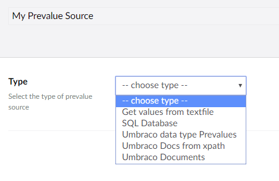
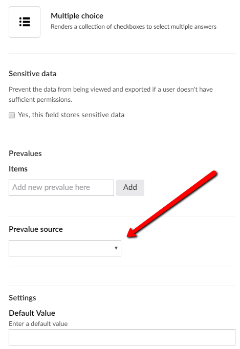

# Defining and attaching prevalue sources

Prevalue sources are a way to pre-define and/or retrieve a list of items from a certain source. They can be used in any fieldtypes that include some kind of list, like Dropdown and Multiple / Single Choice lists.

## Setting up a prevalue source

Prevalue sources can be managed in the corresponding part of the Umbraco Forms section

Right-click the prevalue source tree and select create. You will see a new page where you'll need to setup and configure your prevalue source.

After setting a name, you need to select the type of prevalue source you'll want to use. An overview of the different default types can be found in the [Prevalue source types](Prevalue-source-types) article.

### Configure the prevalue source

Depending on the type you choose, you'll need to provide some additional settings.

In this walk-through we will choose `Get values from textfile`:

We need to provide a file containing the list we want to use as prevalues. This could be a `.txt` file containing the following:

	example value 1
	example value 2
	example value 3
	example value 4
	example value 5

Once the settings are populated, save the prevalue source by hitting the Save button. If the settings are successfully validated and they return results, you will be able to see an overview of the values.

## Attaching a prevalue source to a field

Once a prevalue source has been created, we can now use it when building forms in the Forms designer.

The example below is the settings for a Multiple Choice fieldtype. When there is at least one prevalue source defined in your project, the Prevalues section will contain a dropdown from where you can choose to use a prevalue source.

Once you have chosen the prevalue source you want, you will see a render of the field in the Forms designer using the values from the attached source.

## [Overview of the default prevalue source types](Prevalue-source-types)
