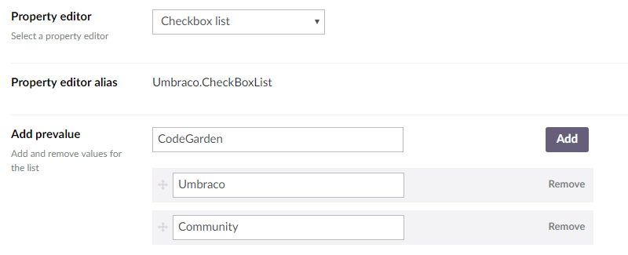

# 复选框列表 #

`返回值: 逗号分隔的字符串`

将预设值显示为复选框控件列表。保存的文本是一个逗号分隔的文本字符串。

**注意: 不同于其他属性编辑器，不能在 Razor 中直接访问预设值的 ID。**

## 数据类型定义示例 ##



## 内容示例 ##


## MVC 视图示例 ##

### 强类型: ###

	@{
		if (Model.Content.HasValue("superHeros")){
			<ul>
			@foreach(var item in Model.Content.GetPropertyValue<string>("superHeros").Split(',')) {
				<li>@item</li>
			}
			</ul>
		}
	}

### 动态 (Obsolete) ###

**警告**

**查看[常见陷阱](https://our.umbraco.com/documentation/reference/Common-Pitfalls/#dynamics)来了解为什么动态方法已经过时的更多信息。**

```csharp
@{
    if (CurrentPage.HasValue("superHeros"))
    {
        <ul>
            @foreach (var item in CurrentPage.superHeros.Split(','))
            {
                <li>@item</li>
            }
        </ul>
    }
}
```