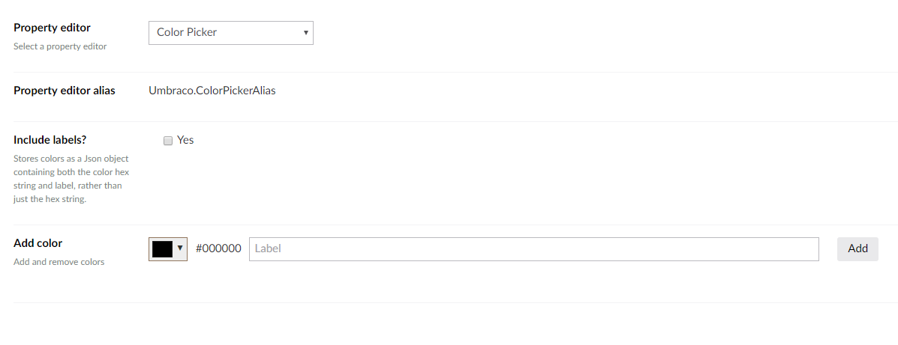
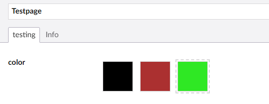

# 颜色选择 #

`Alias: Umbraco.ColorPicker`

`Returns: String (Hexadecimal)`
`Returns: Umbraco.Core.PropertyEditors.ValueConverters.ColorPickerValueConverter+PickedColor (When using labels)`

颜色选择器允许你设置一些预订的颜色，使编辑者可以在其中选择。

## 数据类型定义示例 ##



## 内容示例 #



## 示例

```csharp
@{
    var hexColor = Model.Content.Color;
    String colorLabel = Model.Content.Color.Label;

    if (hexColor != null)
    {
        <div style="background-color: @hexColor">@colorLabel</div>
    }
}
```