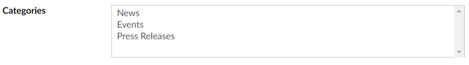

# 下拉列表 #

`Returns: String`

在 Umbraco v7.10中引入。显示预设值列表。可以返回单个值或者多个值（格式为逗号分隔的字符串）。


## 设置 ##

### Enable multiple choice ###

如果勾选，编辑者可以从下拉列表中选择多个值，否则只能选择一个值。

### Prevalues ###

Prevalues是显示在下拉列表中的选项。你可以在这里添加、编辑或者删除值。

## 数据类型定义示例 ##


## 内容示例 ##

### 单个值 ###


### 多个值 ###



## MVC 视图示例 ##

### 类型 - 单个条目 ###

```csharp
@if (Model.Content.HasValue("category"))
{
    <p>@(Model.Content.GetPropertyValue<string>("category"))</p>
}
```

### 类型 - 多个值 ###

```csharp
@if (Model.Content.HasValue("categories"))
{
    var categories = Model.Content.GetPropertyValue<string>("categories").Split(',');
    <ul>
        @foreach (var category in categories)
        {
            <li>@category</li>
        }
    </ul>
}
```