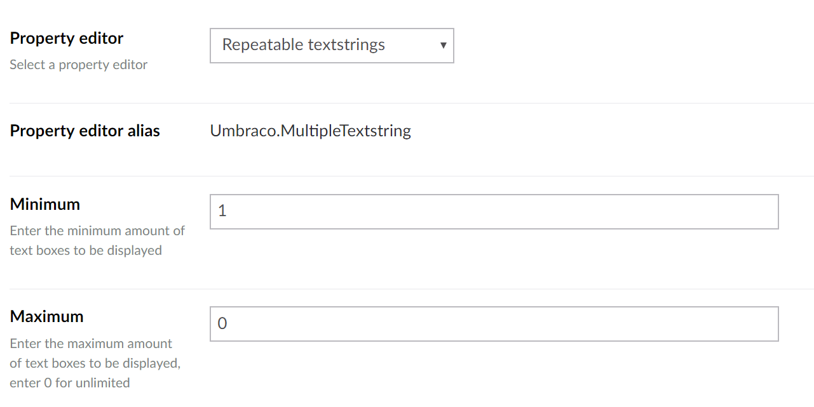
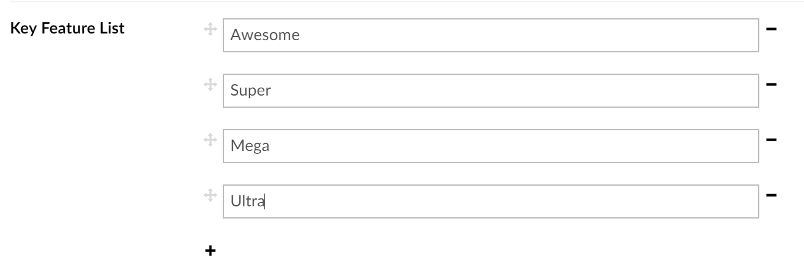

# 可重复的文本字符串 #

`Alias: Umbraco.MultipleTextstring`

`Returns: array of strings`

可重复的文本字符串属性编辑器允许内容编辑器生成一个文本条目的列表。最好与无序列表一起使用。

## 数据类型定义示例 ##

## 内容示例  ##

## MVC 视图实例 ##

### Typed: ###
	
    @{
        if (Model.Content.GetPropertyValue<string[]>("keyFeatureList").Length > 0)
        {
            <ul>
                @foreach (var item in Model.Content.GetPropertyValue<string[]>("keyFeatureList"))
                {
                    <li>@item</li>
                }
            </ul>
        }
    }

### Dynamic (Obsolete): ###

范文 [Common pitfalls](https://our.umbraco.com/documentation/reference/Common-Pitfalls/#dynamics) 了解更多为什么动态方式过时的信息。

    @{
        if (CurrentPage.keyFeatureList.Length > 0)
        {
            <ul>
                @foreach (var item in CurrentPage.keyFeatureList)
                {
                    <li>@item</li>
                }
            </ul>
        }
    }
