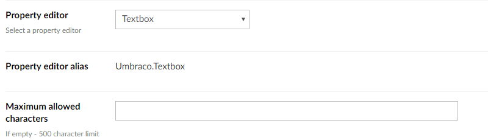
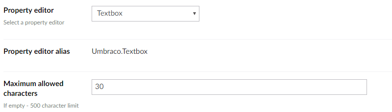
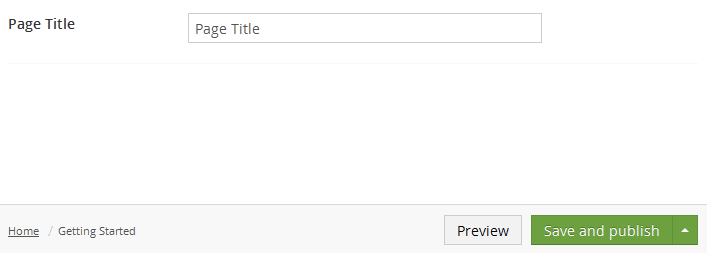
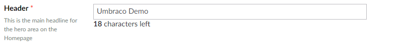

# 文本框 #

`Alias: Umbraco.Textbox`

`Returns: String`

Textbox是用于简单文本的 HTML 输入控件。可以配置灵活的字符长度限制。默认的最大字符数是500，除非它被专门更改为较低的字符数。

## 数据类型定义示例 ##

### 不带字符限制 ###

### 带有字符限制 ###

## Settings ##

## 内容示例: ##

### Without a character limit

### With a character limit

## MVC 视图示例: ##

	@{
	   if (Model.Content.HasValue("pageTitle")){
	       
@(Model.Content.GetPropertyValue<string>("pageTitle"))

	   }
	}

### Dynamic (Obsolete): ##

访问 [Common pitfalls](https://our.umbraco.com/documentation/reference/Common-Pitfalls/#dynamics) 了解更多关于为什么动态方法已经过时的信息。
	
	@{       	
	   if (CurrentPage.HasValue("pageTitle")){	
	       
@CurrentPage.pageTitle
	
	   } 	       	
	}
