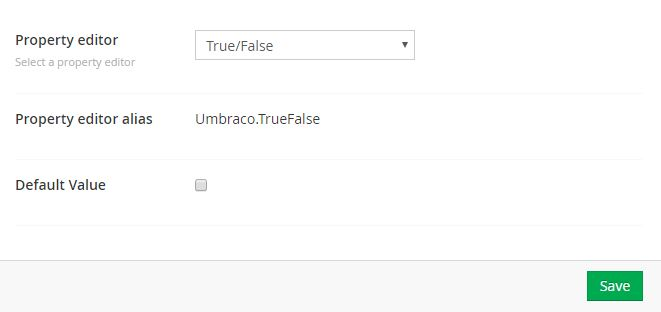

# 是/否 #

`Returns: Boolean`

是/否 是一个简单的复选框，保存值是0或1，这取决于你是否选取了。

## 数据类型定义示例 ##

## 内容示例 ##

## MVC 视图示例 - 显示子页面中没有隐藏的链接列表 ##

### Typed: ###

	@{
		foreach (IPublishedContent page in Model.Content.Children){
			if (!page.GetPropertyValue<bool>("umbracoNaviHide")){
				
@page.Name

			}
		}	
	}

### Dynamic (Obsolete): ###

访问 [Common pitfalls](https://our.umbraco.com/documentation/reference/Common-Pitfalls/#dynamics) 了解更多关于为什么动态方法已经过时的信息。

	@{
		foreach (var page in CurrentPage.Children){
			if (!page.umbracoNaviHide){
				
@page.Name

			}
		}	
	}