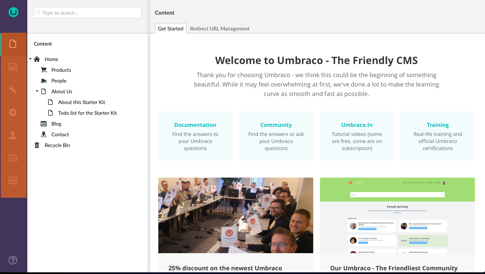

# 板块 #
Umbraco 中的一个板块是指用于执行该板块相关的特定任务集合。例如：Content、Settings 和 Developer 都是板块。您可以通过单击位于后台左侧的分区菜单中的相应图标在不同分区之间导航。

*__Section menu__ 是后台中位于左侧的垂直菜单。*

Umbraco 附带8个默认板块：

###  Content ###
Content板块包含所有网站的内容。内容在内容树中显示为节点。节点还可以显示内容状态：

* 灰色节点尚未发布
*  节点具有未发布的版本（但当前已发布）
*  节点受保护，非公开节点 (需要登录)
*  节点当前锁定，不能删除
*  节点是容器 (例如 List Views)

为了创建内容，你必须使用 Document Types定义它们。

###  Media ###
Meida 板块包含了网站所有的媒体。默认情况下，您可以创建文件夹并上传媒体文件（图片和 PDF）。你可以自定义现有的媒体类型，或者在 Settings 板块中定义您自己的媒体类型。

###  Settings ###
Settings 板块是管理网站布局，语言/本地化以及定义媒体和内容的地方。Settings 树结构包含： 

- Document Types
- Templates (.cshtml 文件)
- Partial views (.cshtml 文件)
- Stylesheets (.css 文件)
- Scripts (.js 文件)
- Languages
- Dictionary
- Media Types

###  Developer ###

在 Developer 板块你可以处理包，数据类型，宏，关系，XSLT 以及 Razor 文件。Developer 树包含：

- Packages
- Data Types
- Macros
- Relation Types
- XSLT files
- Partial View Macro Files

###  Members ###
管理，创建和自定义用户，用户类型以及用户组。

###  Users ###
管理，创建和自定义后台用户以及用户组。

###  Forms ###
你可以在后台中通过点击来直接安装 Umbraco Forms 组件。安装完成后，可以在这个板块中创建并管理你的表单。

###  Help ###

打开“帮助”板块后，您将获得一个指向有关您所在部分的视频教程的链接。

## 更多信息 ###
除了 Umbraco 附带的默认板块，您可以创建你自己的[自定义板块](../../../Extending/Section-Trees/index.md)。
