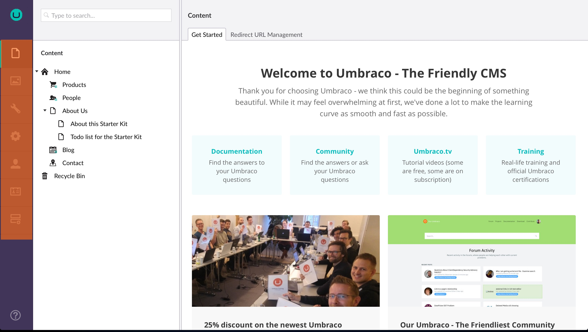
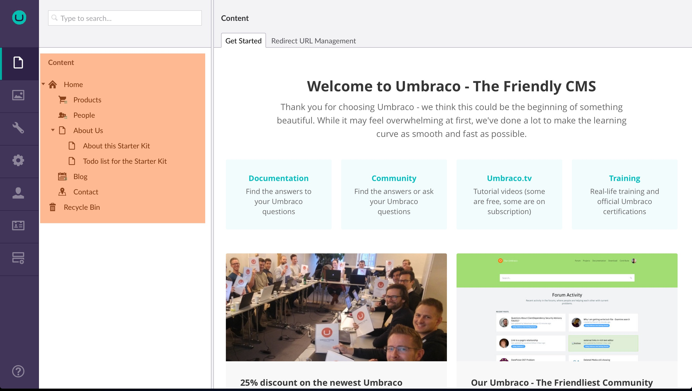
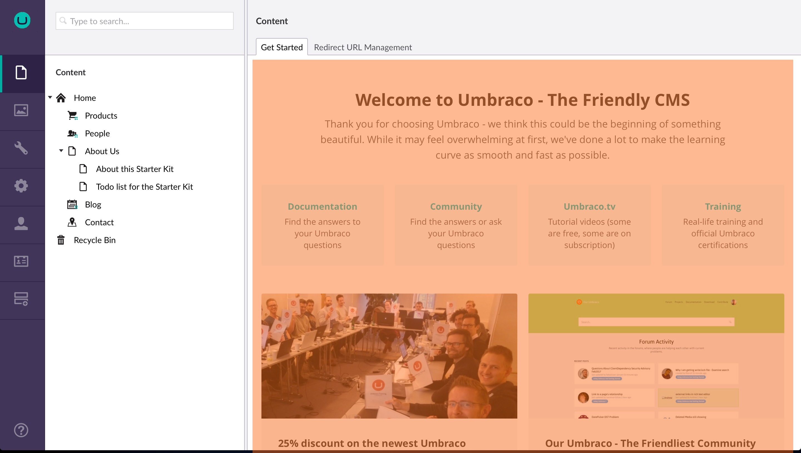

# 后台概述 #
在本文中，您可以了解更多Umbraco后台中使用的常见术语和概念。

### [登录窗口](Login/) ###
当你第一次进入后台时，你会看到登录窗口。[了解更多关于登录窗口](Login/).

 

### [板块](Sections/) ###
Umbraco 中的板块是指用于执行该板块相关的特定任务集合。例如：Content、Settings 和 Developer 都是板块。您可以通过单击位于后台左侧的分区菜单中的相应图标在不同分区之间导航。[了解更多关于 Section 菜单](Sections/).

*__Section menu__ 是后台中位于左侧的垂直菜单。*

### [树](../../Extending/Section-Trees/index.md) ###
树是与特定概念相关（通常受限制）的项目的层次列表，可以是内容树或媒体树。你可以通过点击节点左侧向下的箭头或者双击节点来展开树。

[阅读更多关于树的信息](../../Extending/Section-Trees/index.md)

*内容树*

### 节点 ###
节点是树中的项目。Media 板块中的图像和文件夹显示为Media树中的节点、内容树中的页面和内容等。

### [仪表板](../../Extending/Dashboards/index.md) ###
仪表板是在进入后台的某个板块时显示的主视图，可用于向系统用户显示有价值的信息。[了解更多关于仪表板的信息](../../Extending/Dashboards/index.md)

*默认的仪表板在Content板块中*

### 编辑器 ###
编辑器是用来在后台编辑不同项目的工具。有专门用于编辑样式表的编辑器，也有用于编辑宏的编辑器等等。

### [内容](../Data/Defining-Content/) ###
内容是指在内容区块的页面和内容。树中的每一个条目都称之为节点。内容树中的每个节点都存在不同的字段。每一个内容条目（或节点）都是由文档类型所定义的。
[了解更多..](../Data/Defining-Content/)

### 文档类型 ###
文档类型定义了后台用户可以在内容树中创建的页面/内容类型。每个文档类型都包含不同的属性或字段。每个字段都包含特定的数据类型，例如：文本、数字……

### Properties ###
每个文档类型都包含属性。这是内容编辑器中允许为节点编辑的字段。

### [数据类型](../Data/Data-Types/) ###
文档类型中的每一个属性都包含一个数据类型，它定义了该属性的输入类型。数据类型指向一个属性编辑器，在Umbraco后台的开发区块中可以进行配置。

一个数据类型可以非常简单（textstring、number、true/false、……），或者比较复杂（multi node tree picker、image cropper、……）
[了解更多..](../Data/Data-Types/)

### [属性编辑器](Property-Editors/) ###
属性编辑器是向 Umbraco 插入内容的一种方式。富文本编辑器就是属性编辑器的一个实例。它可能会与数据类型混淆。可能有很多富文本编辑的数据类型使用了不同的设置，而他们都使用了富文本编辑类型的属性编辑器。 [了解更多关于属性编辑器的信息](Property-Editors/)

### [Media](../Data/Creating-Media/) ###
Media 区块中的 Media 条目，用于存储类似于图片和视频一类的资源，并且可以从你的内容中引用它们。
[了解更多..](../Data/Creating-Media/)

### Media Type ###
它是专门用于指定 Media 板块中的 media 条目，媒体类型与文档类型非常相似。

### [Member](../Data/Members/) ###

会员是指某个已经注册、登录并可以操作你的**公开网站**的人，不要与用户混淆
[了解更多..](../Data/Members/)

### Member Type ###
类似于文档类型和媒体类型。你可以定义一些自定义属性，用于存储会员的 twitter 账户、网站 URL 等。

### [Templates](../Design/Templates/) ###
模板是为你的网站定义 HTML 标记的地方。布局通常是通用的模板，包含一些通用的标记，类似于`<head>` 段落。
[了解更多](../Design/Templates/)

### Package ###
package 是指能够扩展 Umbraco的模块或者插件的Umbraco 术语。关于包可以在这里找到[Umbraco项目](https://our.umbraco.org/projects/ "Projects on Our Umbraco").mbraco](https://our.umbraco.com/projects/ "Projects on Our Umbraco").

### [Macros](../../Reference/Templating/Macros/) ###
宏是可重用的功能组件，它可以在你的整个站点中重复使用。宏可以配合参数配置，支持插入富文本编辑器。你可以定义哪些已有的宏可以在编辑器中使用。当编辑器中插入宏时，它会提示要输入已经定义好的参数。
[了解更多..](../../Reference/Templating/Macros/)

### [Macro Parameter Editor](../../Extending/Macro-Parameter-Editors/) ###
参数编辑器定义属性编辑器的用法，作为宏的参数使用。
[了解更多..](../../Extending/Macro-Parameter-Editors/)

### User
用户是指可以操作**Umbraco后台**的人，不要与会员混淆。在安装 Umbraco 时，会使用输入的 login、email 和密码生成用户。用户可以在 User板块中创建、编辑以及管理。

### [内容模板](Content-Templates/)
内容模板为基于现有节点的内容节点提供蓝图。