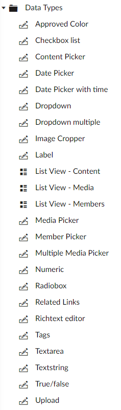

# 默认数据类型 #

以下是随Umbraco一起安装的一些默认数据类型的列表。您基于安装好的[Property Editors](../../Backoffice/Property-Editors/)创建更多的属性。

####Approved Color####
添加了一些可用的颜色列表可以通过点击选择。可用颜色需要添加16进制值到预设值字段（不带#号）。例如，cccccc

####Checkbox list####
将预先设置的值列表显示为复选框控件列表。修改预设值在开发区块下面的"数据类型/checkbox list"添加新条目。值保存为逗号分隔的预设值 ID 字符串，也可以很容易的使用 xslt操作(umbraco.library:GetPrevalue())。

####Content picker####
内容选取器打开一个简单的模态窗口，在内容结构中选取特定的页面。这个值会保存选中页面的 ID。

####Date picker####
显示一个日历 UI 用于选择日期和时间，值会保存为标准的日期时间值，但是不会有时间信息。

####Date picker with time####
显示一个日历 UI 用于选择日期和时间，值会保存为标准的日期时间值。

####Dropdown####
将预先设置的值列表显示为只能选择一项的下拉列表。修改预设值在开发区块下面的"数据类型/ dropdown multple"添加新条目。值保存为逗号分隔的预设值 ID 字符串。

####Dropdown multiple####
将预先设置的值列表显示为可以多选的下拉列表。修改预设值在开发区块下面的"数据类型/ dropdown multple"添加新条目。值保存为逗号分隔的预设值 ID 字符串。

#### Image Cropper ####
允许使用焦点来裁剪上传的图片。特定裁剪定义可以添加。这个数据类型默认添加在图片媒体类型上。

####Label####
是一个不可编辑的控件，仅能用于显示已有值。它可以用于在媒体区块加载节点的相关值，例如 width，height 和 file size 等。

#### List View - Content ####
此数据类型用于把文档类型显示为列表视图。 

#### List View - Media ####
此数据类型用于把媒体类型显示为列表视图。

#### List View - Members ####
此数据类型用于把用户类型显示为列表视图。

#### Media Picker ####
选取器打开一个简单的模块窗口，从媒体树中选取指定的媒体条目。

保存的值是所选媒体的节点 UDI。

#### Multiple Media Picker ####
选取器打开一个简单的模块窗口，从媒体树中选取多个媒体条目。

保存的值是逗号分隔的所选媒体的节点 UDIs。

#### Member Picker ####
将所有的用户显示为简单的下拉。可以选中某一个用户。

保存的值是用户的 ID。

#### Numeric ####
输入数字值的简单文本框。

#### Radiobox ####
这个数据类型允许编辑者从单选按钮中选择。

#### Related Links ####
这个数据类型允许编辑者简单的添加链接数组。这个可以是 Umbraco 内部页面或者外部 URLs。

#### Richtext Editor ####
TinyMCE 基于wysiwyg编辑器。这是用来编辑大量文本的标准编辑器。编辑器有很多的设置，可以在开发区块下面的数据类型/Richtext editor 中更改它们。编辑器还支持 TinyMCE 的插件，可以在位于/config/tinyMce.config的配置文件中，控制它们。

在默认设置中，可以使用一些标签，如标点列表。如果你想使用其他标签，例如如H1或H2，你需要添加样式表。

在基本样式中为每个标签（h1或 h2）创建子样式表。前往"Back office->Developer->Data Types->Richtext editor"，关联基本的富文本编辑器。还要在工具栏部分，开启"styleselect"。在内容编辑时你可以在工具栏中找到新的按钮。

一个样式表树的例子如下：

<pre>
Stylesheets
-IE7
-IE8
-Style
-RichEdit
--h1
--h2
</pre>

####Tags####
标签类型允许你给一个文档类型赋予多个标签 - 这通常用于博客和你希望完美的归类数据。当你创建数据类型时，可以指定标签组，你可以给网站的不同板块使用标签（例如新闻，文章，活动等）。

#### Textarea ####
简单的文本域。

####Textstring####
普通的 html 文本输入字段

####True/False####
简单的复选框，保存为0或者1，取决于复选框是否选取。一个常见的例子是，创建一个属性，指定别名为'umbracoNaviHide'数据类型为 True/False，这允许编辑器从导航菜单中隐藏节点。

####Upload####
添加一个上传字段，可以允许上传文档或图片到 Umbraco 中。但这并不会将它们添加到媒体库，只是简单的添加到文档数据中。