# 多语言网站#

## 多语言前端 ##
_注意: 这是在 Umbraco7.8.1中演示的，新旧版本可能会有所不同。这里假设你已经有了一个使用某个语言内容的网站。_

### '/'的表现形式 ###
请注意最顶级的网站节点上没有设置域名，那么'/'会导航到内容树的第一个"语言/区域"站点。这是特定的行为。

### 第一步 ### 
在配置多语言网站的时候，首先需要复制你已有原始语言中的内容。选中你想要复制的节点 - 在此例中通过复制"Home"节点，可以同时复制所有的子级内容，左键点击"Home"并在菜单中点击"Copy"。
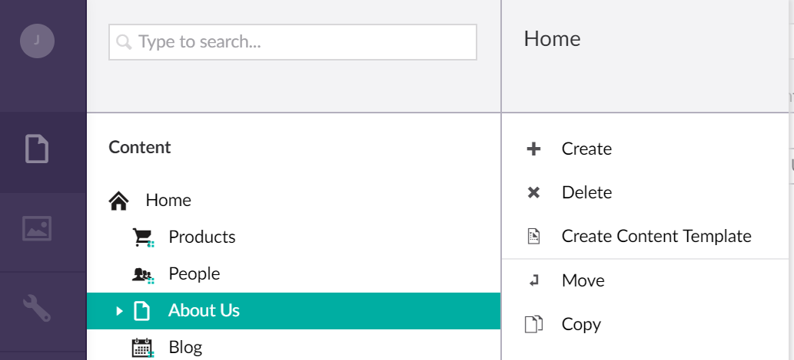

选择你要复制到的新节点位置的父节点，在本例中它是"Content"（这意味着你复制的"Home"节点与当前的"home"节点是平级的），如果你想同时复制所有的子节点，选中"Include descendants"选框。
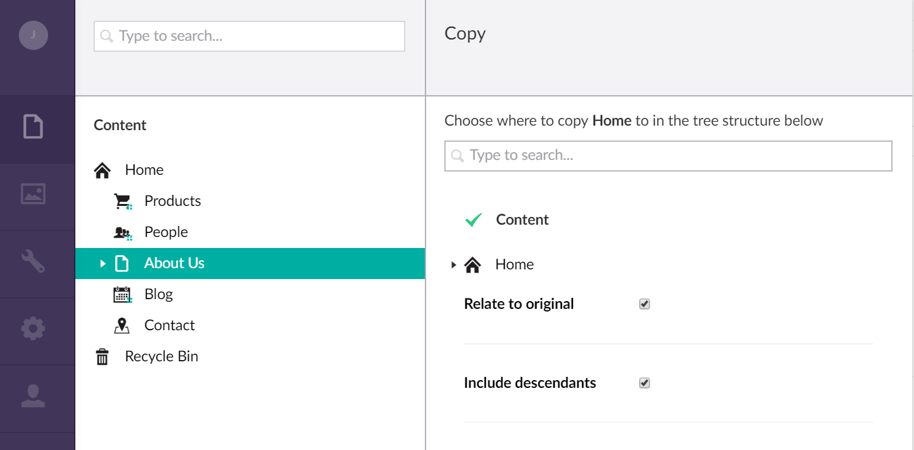

你将会得到一个完整的副本，如下图所示:
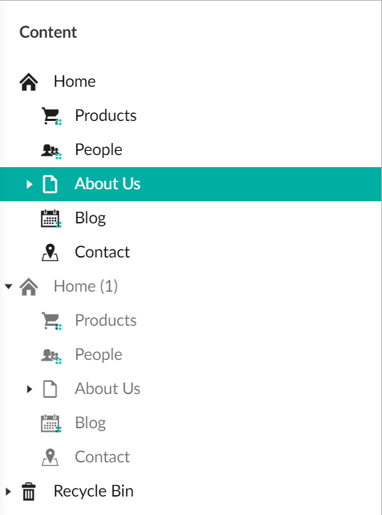

现在你可以前往复制好的节点中，将所有文本更改为任何你想要的语言。

### 第二步 ###
第二步是在"Setting"中创建一个新的语言。执行此操作，只需要在"Setting"菜单的"Languages"下方，选择你想要创建的语言文件
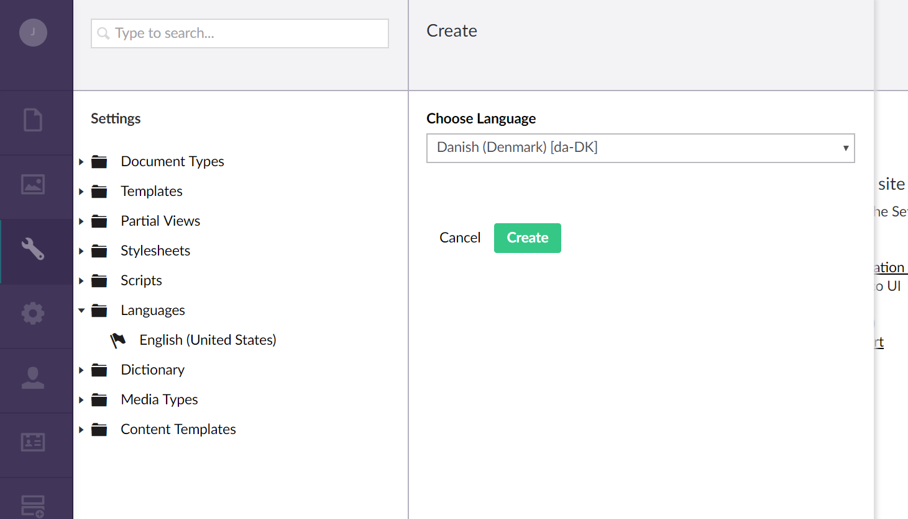

现在我们前去内容节点并为它们分配一种语言。在"Home"节点上点击右键并选择'Culture and Hostnames'，然后选择与页面关联的语言。（注意：你会看到默认选项是'Inherit'，因此如果你设置了顶级节点，所有子节点会自动继承）
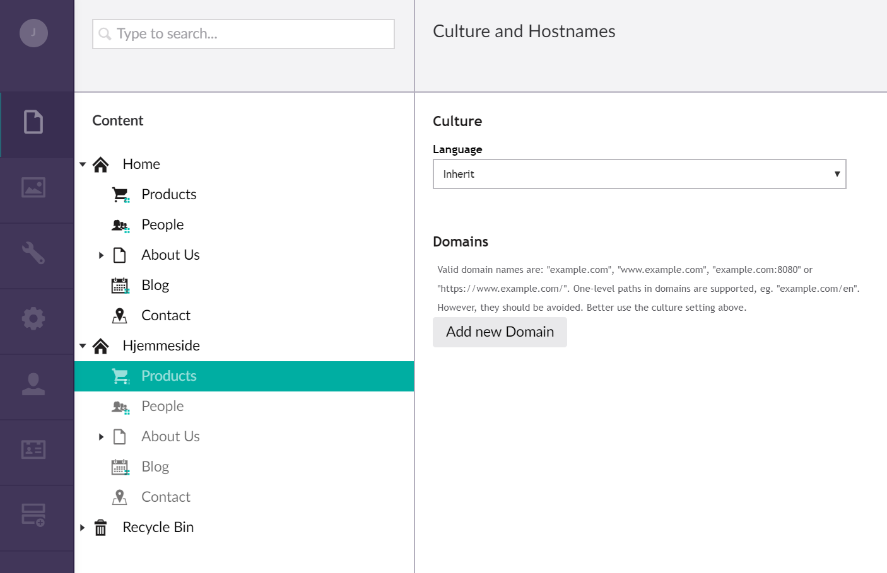

### 第三步 ###
取决于你网站的设置方式，并不是所有内容都可以通过"Content"节点编辑。有些内容可能会写在模板中，而字典条目正是用于此。

这里有个简单的例子就是一些按钮文本可以添加到字典中（模板可以在"Setting"菜单下方找到）。
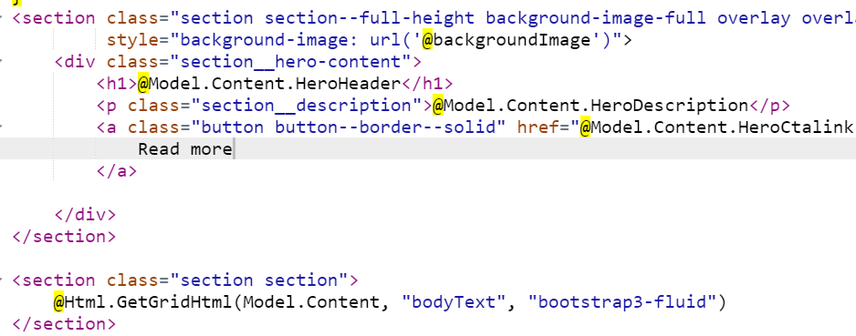

右键点击菜单中的"Dictionary" 然后创建一个新的条目，给它一个唯一的别名，然后写下每种语言的相关文本。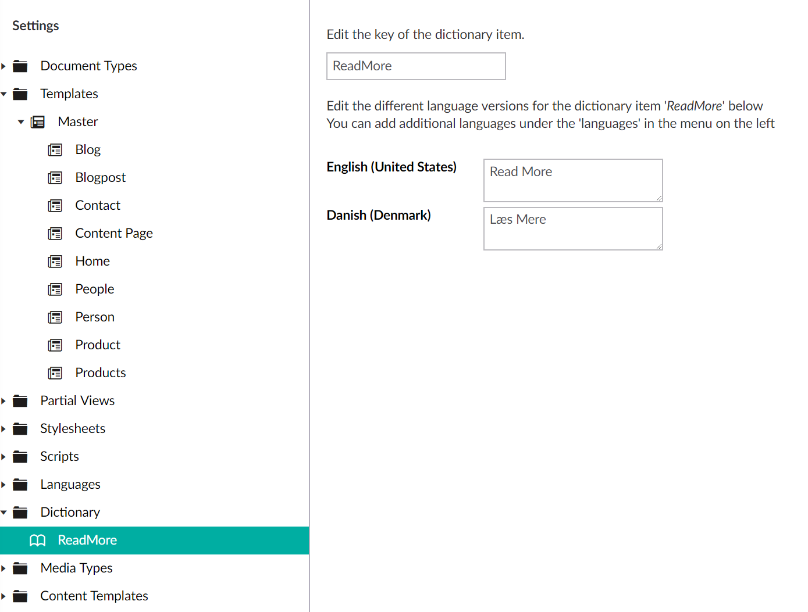

返回到你的模板中，并且使用@Umbraco.GetDictionaryValue("ReadMore")来替换之前的文本。
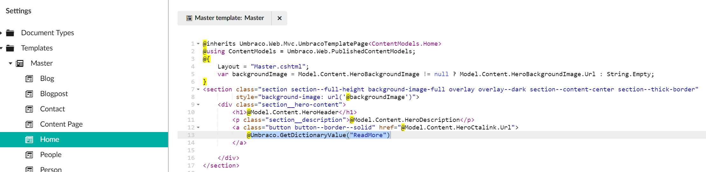

### 第四步 ###
把语言添加到你网站的 url 中，首先你需要开启完整 url。打开 Web.config 文件，将umbracoHideTopLevelNodeFromPath的值由"true" 改为"false"。
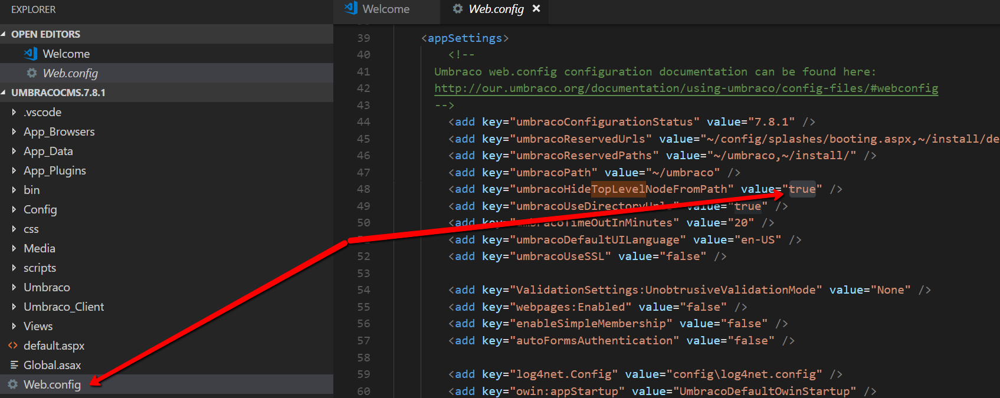

接下来你可以将首页名替换为它们的语言名称，如果你更改"English" 首页名为'en'，"Danish"名未'dk'，链接看起来是这样的：

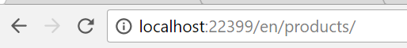
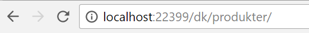

### 最后一步 ###
添加一个语言菜单用于在不同语言之间切换，你可以修改你的菜单模板，添加下面的代码：
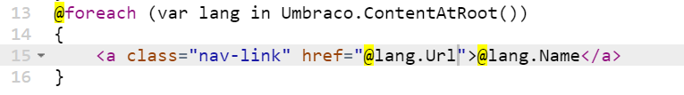

最终结果:
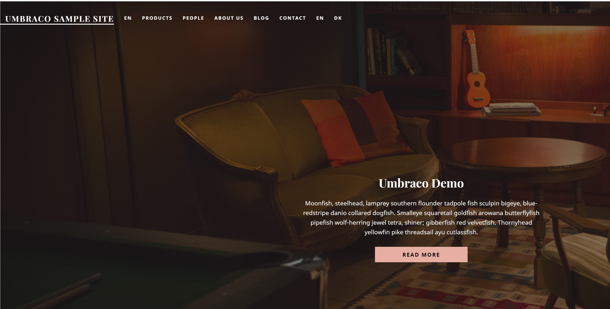
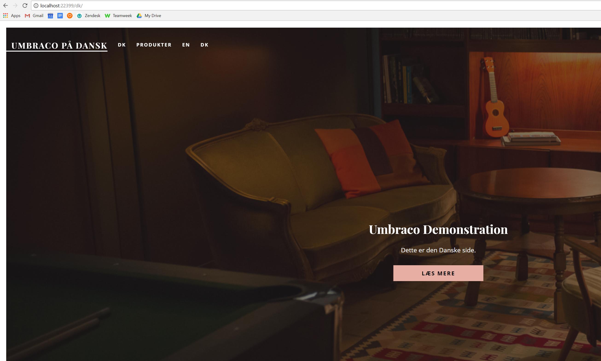

当然，您还可以做很多事情来定制它，但是基本原理都在这里！

##多语言后台##
在 Umbraco 中，想要翻译文档类型中的标签页、名称和描述，可以使用词典。你还可以翻译你的文档名称。
翻译这些标签非常简单。考虑文档类型中的以下文本：

**Tab**: Content 
**Name**: Header 
**Description**: This is the header of the page.

文档类型的名字是"Document"。

如果你为这些字段创建了翻译为其他语言的词典条目，你就可以直接引用它们，然后那些标签会显示为和你的编辑者登录 Umbraco 语言一致的文本。因此你只要简单的引用词典的名字，同下面一样：

**Tab**: #Content 
**Name**: #Header 
**Description**: #HeaderDescription

同样的，文档类型的名字可以通过 #Document 来引用。

因此它是通过"hashtag" (#)符号加字典条目的别名，来让 Umbraco 在字典中查找实际的文本内容。

###重要!###

撰写本文时，Umbraco 的默认语言是 en-us，而 administrator 账户的语言设置为 en-uk。如果你尝试上面的操作，示例仅仅会在名称标签上显示[#Header]，这会造成一些混乱。为此，你可以将administrator账户的语言设置为 en-us。

这对所有低于 Umbraco6.1.1的版本都是必要的操作。